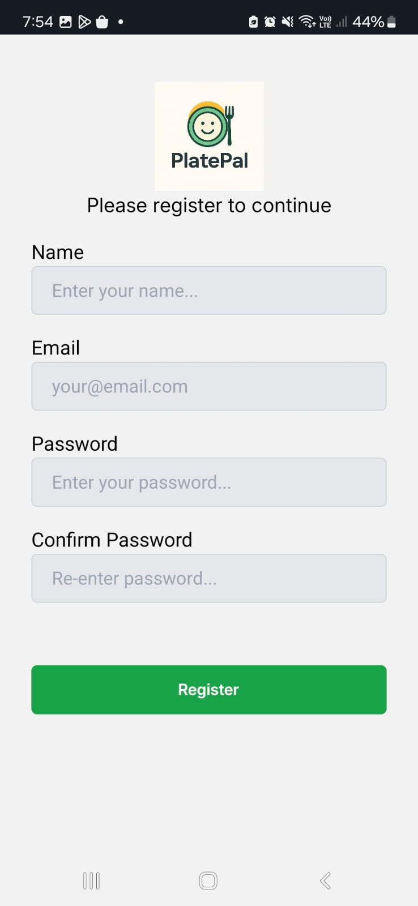
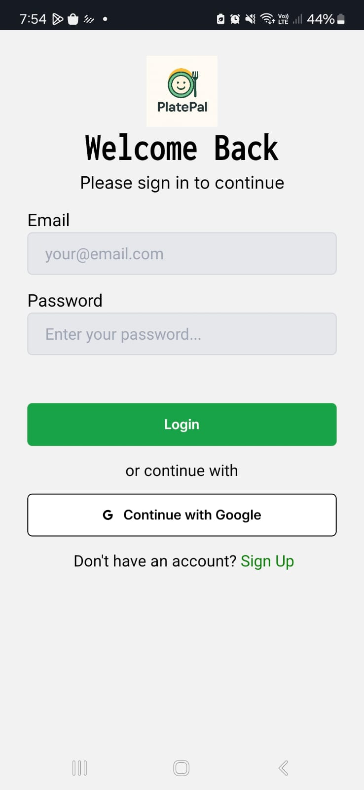
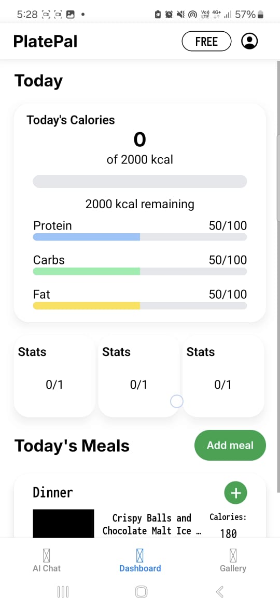
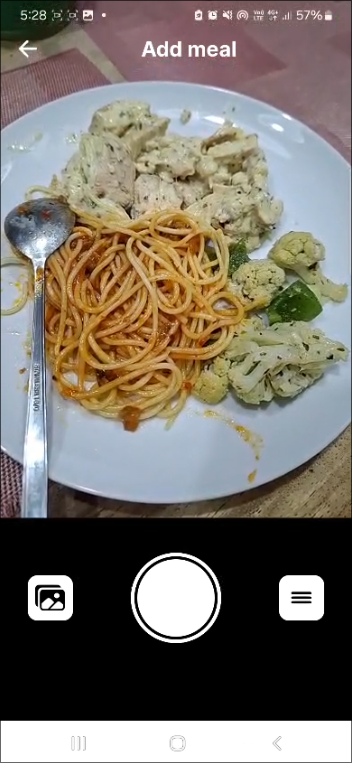
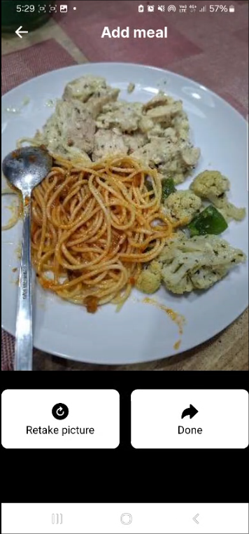
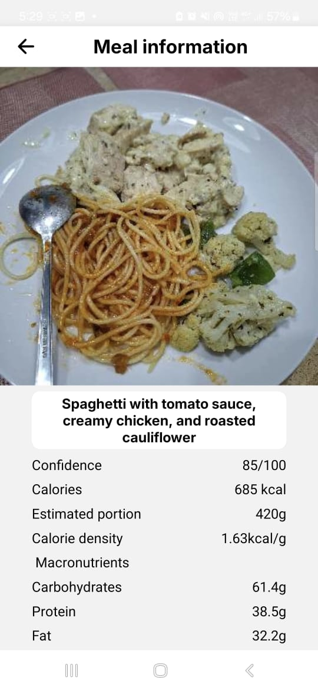
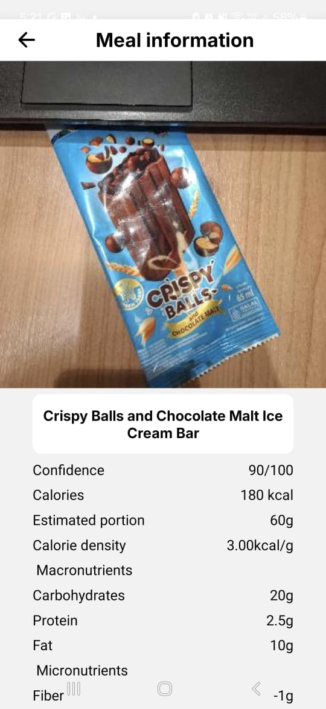

# PlatePal Frontend


Mobile nutrition tracker that uses LLMs for automatically obtaining
nutritional information.

APK Download link from EAS build: [PlatePal Download](https://expo.dev/artifacts/eas/nU6C1FjEg3qB8QXGzpHbT1.apk)


## Directories

- /api - Collection of classes that provide methods to query the backend.
- /app -  Collection of .tsx files that provide the UI layer of the application
- /app/auth - Authentication pages (/login and /register)
- /app/app/(tabs) - Main pages, consist of dashboard, AI chat, and Gallery (only dashboard implemented)
- /app/app/meals - Pages for adding meal and mealItems
- /assets - Store fonts used for the application
- /components - Store reusable components for the User Interface
- /theme - Dark theme and light theme
- /types - Provide types for objects that are common in multiple pages for reusability

## Pitch Deck

Pitch deck is available in [Canva](https://www.canva.com/design/DAG-lzVMVoA/2PuzEhCihgWxzbReLxxhZA/edit?utm_content=DAG-lzVMVoA&utm_campaign=designshare&utm_medium=link2&utm_source=sharebutton)

## Get started

This is an [Expo](https://expo.dev) project created with [`create-expo-app`](https://www.npmjs.com/package/create-expo-app).

1. Install dependencies

   ```bash
   npm install
   ```

2. Start the app

   ```bash
   npx expo start
   ```


## Screenshots

### Login/Register




### Dashboard




### Camera




### Meal info





